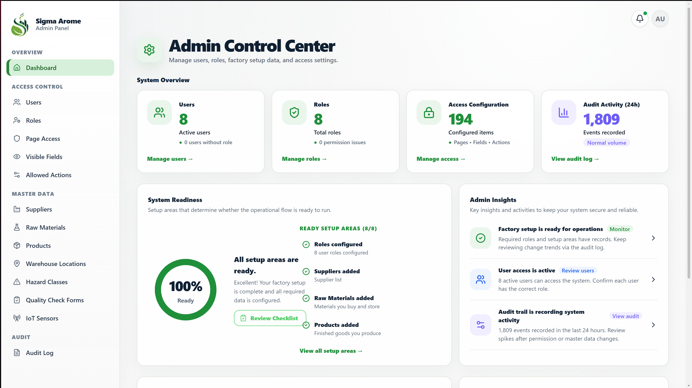
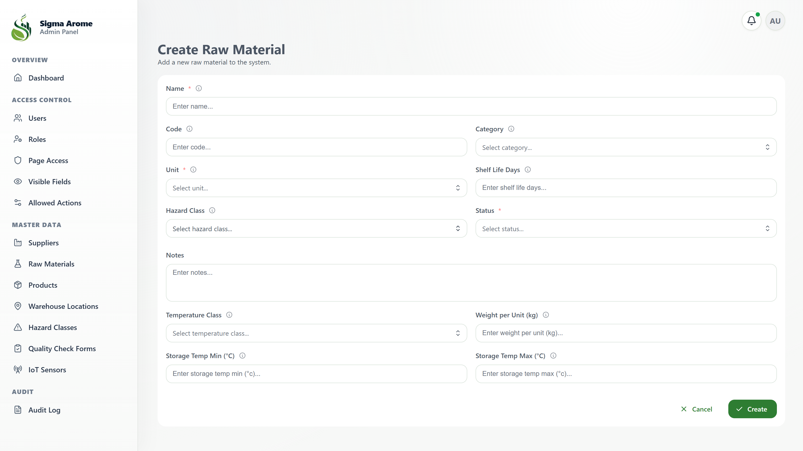
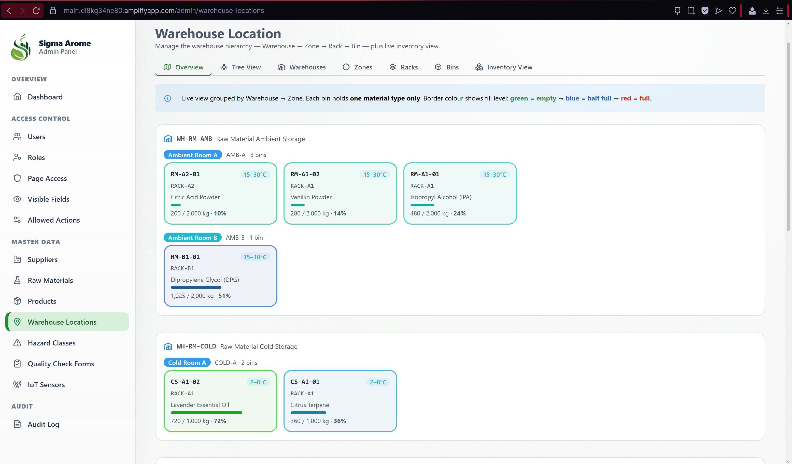
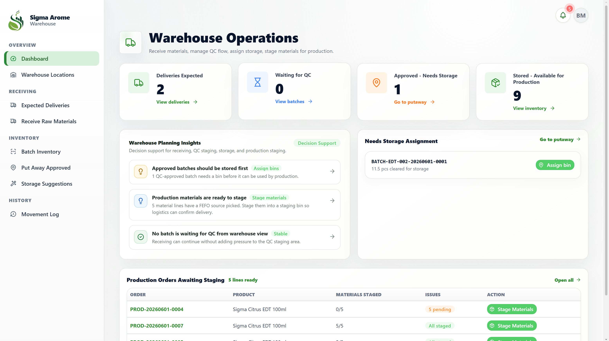
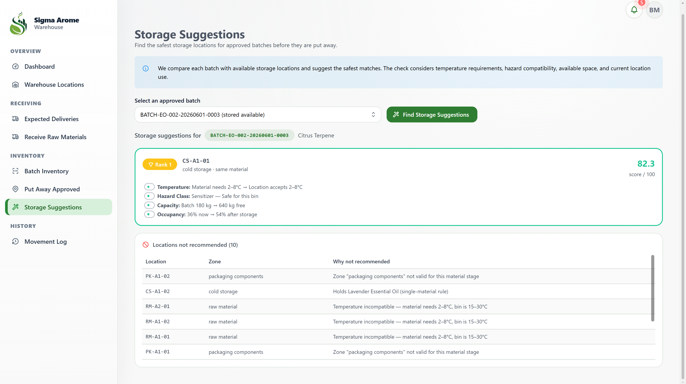
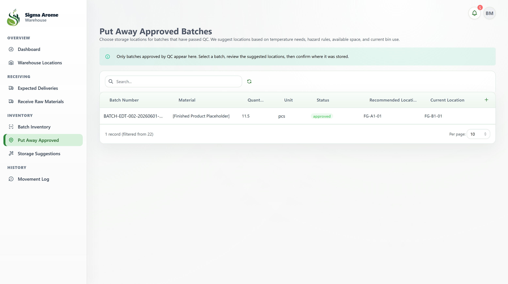
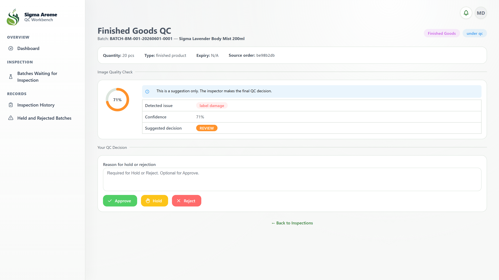
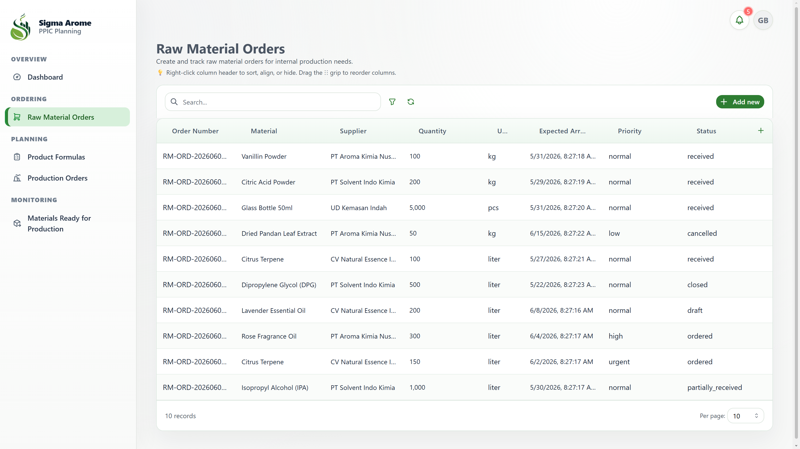
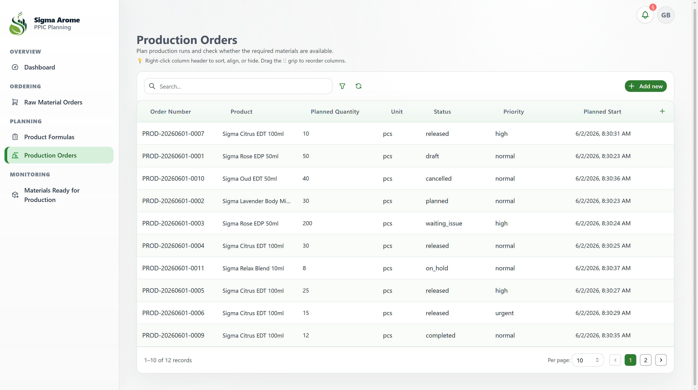
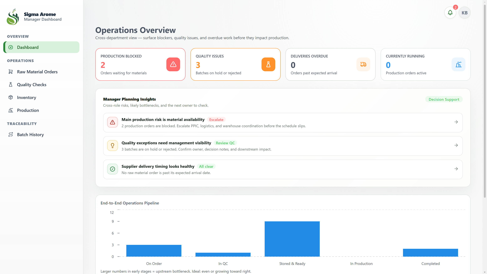

# Sigma Arome Smart Operations

> A role-based smart manufacturing operations platform for fragrance, essential oil, and chemical production, covering the full flow from raw material ordering to finished goods putaway.

---

## Overview

Sigma Arome Smart Operations is a web-based manufacturing operations system for fragrance and chemical factories. It connects raw material ordering, receiving, quality control, rule-based warehouse slotting, production planning, and finished goods storage in one traceable platform.

Each user role receives a dedicated dashboard with the data, permissions, and actions needed for its workflow. The system reduces spreadsheet dependency, improves batch traceability, and creates an automatic audit trail for critical operational changes.

### What It Does

- Digitizes the internal manufacturing flow from PPIC raw material ordering to finished goods putaway.
- Tracks raw material batches through receiving, QC, storage, production consumption, and finished product creation.
- Recommends compatible warehouse storage bins using an explainable rule-based slotting engine.
- Gives Admin, Manager, PPIC, Warehouse, QC, Logistic, and Production users role-specific dashboards.
- Maintains batch traceability and audit history across warehouse and production activities.

### Target Users

- Admin teams managing users, master data, access control, and audit logs
- PPIC planners managing material orders, BOMs, and production readiness
- Warehouse Operation staff handling receiving, putaway, inventory, and movement logs
- QC inspectors reviewing, holding, approving, or rejecting batches
- Production operators executing production orders and creating finished goods batches
- Logistic coordinators managing material movement
- Managers monitoring KPIs, bottlenecks, alerts, and traceability

---

---

## Team Members Citak Bana

| Name | Role |
| --- | --- |
| Severinus Fabian Tanuwidjaja | The Designer |
| Steven Alvin Christian | The Mastermind |
| Melvan Hapianan Allo Ponglabba | The Mediator |

---

## Live Demo

- **Live Website:** https://main.dl8kg34ne80.amplifyapp.com
- **Demo Video:** https://youtu.be/gzTRbtz-OIA

---

## Screenshots

Screenshots are stored in the `./screenshots/` folder.

### Core / Shared

#### Login / Sign Up Page


#### Setting Page


### Admin Module

#### Admin Dashboard


#### Master Data Form


#### Warehouse Location Floor Plan / Hierarchy


### Warehouse Operation Module

#### Warehouse Dashboard


#### Auto Slotting Recommendations


#### Putaway Flow


### Quality Control Module

#### QC Inspection


### PPIC / Production Module

#### Order Raw Material


#### Production Planning


### Manager Module

#### Manager Overview / Data Visualization


---

## Problem Statement

Sigma Arome's internal factory flow needs stronger digital control across raw material ordering, receiving, QC, storage, production readiness, execution, and finished product release.

Current operational pain points include:

- PPIC cannot easily track whether ordered materials have arrived, passed QC, and become available for production.
- Raw material receiving records and batch data can become fragmented when handled manually.
- QC queues and decisions are not visible in real time across departments.
- Warehouse storage decisions often rely on manual judgment or spreadsheets, which is risky for hazardous and temperature-sensitive chemicals.
- Material movement from warehouse to production is difficult to trace back to finished product batches.
- Managers lack a single operational view of readiness, QC bottlenecks, warehouse status, and alerts.

---

## Solution

Sigma Arome Smart Operations provides a role-based operations platform that acts as the single source of truth for internal factory workflows. The platform enforces business rules on the backend so critical steps cannot be skipped, while every major action is captured in an audit trail.

A key component is the rule-based storage slotting engine. When a batch is released by QC, the engine scores eligible storage bins and recommends the best options. Each recommendation includes an auditable reason, making the result explainable instead of black-box.

The slotting engine evaluates:

- Temperature compatibility
- Hazard compatibility
- Available capacity
- Current occupancy
- Storage eligibility rules

Incompatible bins are eliminated before scoring, helping warehouse teams make safer and more consistent putaway decisions.

---

## Core Workflow

1. **PPIC creates or reviews raw material requirements.**
2. **Warehouse receives incoming raw material batches.**
3. **QC inspects each received batch and sets the decision status.**
4. **Released batches are sent to auto slotting for recommended storage.**
5. **Warehouse confirms putaway and records the storage location.**
6. **PPIC plans production using available materials and BOM data.**
7. **Production consumes approved materials and creates finished goods batches.**
8. **Managers monitor KPIs, alerts, bottlenecks, and end-to-end traceability.**

---

## Key Features

### Admin

- Master data management for suppliers, raw materials, products, hazard classes, QC templates, and warehouse hierarchy
- Role-based access control for permissions, field visibility, and allowed actions
- Read-only audit log for critical changes

### Warehouse Operation

- Receiving and putaway workflows
- Rule-based auto slotting with explainable storage recommendations
- Batch inventory tracking
- Movement log for storage and transfer activity
- Warehouse floor plan grouped by warehouse, zone, rack, and bin

### Quality Control

- QC inspection queue
- Batch inspection workflow
- Approve, reject, and hold decisions
- Downstream status updates based on QC results
- Computer-vision-assisted review simulation for the MVP

### PPIC / Production

- Raw material ordering and production planning
- Bill of Materials management
- Automatic material request generation
- Production execution tracking
- Material consumption, yield, and finished goods batch creation

### Manager

- Operational overview dashboard
- KPI and exception monitoring
- QC bottleneck visibility
- Warehouse status visibility
- End-to-end batch traceability from raw material order to finished product

---

## Tech Stack

### Frontend

- Next.js 16 App Router
- React 19
- TypeScript 5
- Mantine v8
- Buildpad UI components
- Tailwind CSS

### Backend

- Next.js API routes as a server-side proxy
- Buildpad DaaS for data access, runtime extensions, and business logic

### Database

- PostgreSQL via Supabase (Row-Level Security)

### APIs / Services

- Buildpad DaaS REST API for collections, items, permissions, and extensions
- Supabase Auth for server-side, cookie-based authentication

### Deployment

- AWS Amplify with automatic deployment from the `main` branch

---

## Getting Started

This project uses `pnpm`.

```bash
# 1. Clone the repository
git clone https://github.com/SilentlyLucky/Sigma-Arome.git

# 2. Move into the project folder
cd Sigma-Arome

# 3. Install dependencies
pnpm install

# 4. Start the development server
pnpm dev
```

Open `http://localhost:3000` in your browser.

You can also use npm:

```bash
npm install
npm run dev
```

---

## Environment Variables

Create a `.env.local` file in the project root. A reference template is provided in `.env.example`.

```env
# Supabase authentication
NEXT_PUBLIC_SUPABASE_URL=
NEXT_PUBLIC_SUPABASE_ANON_KEY=
SUPABASE_SERVICE_ROLE_KEY=

# Buildpad DaaS data layer
NEXT_PUBLIC_BUILDPAD_DAAS_URL=

# App URL
NEXT_PUBLIC_APP_URL=
```

> **Security note:** Never commit real secret keys or credentials to GitHub. Keep `.env.local` in `.gitignore`. Only commit `.env.example` with empty values. `SUPABASE_SERVICE_ROLE_KEY` is highly privileged and must stay server-side only.

---

## Demo Guide

For judges and first-time users:

1. Open the live website.
2. Log in with one of the available role accounts.
3. Start in the Admin module to review master data and warehouse hierarchy.
4. Move to Warehouse Operation to receive a raw material batch.
5. Open QC to inspect and release the batch.
6. Return to Warehouse Operation to view auto slotting recommendations and confirm putaway.
7. Open PPIC / Production to review production planning and execution.
8. Use the Manager module to review KPIs, exceptions, and batch traceability.

### Demo Accounts

| Role | Email | Password |
| --- | --- | --- |
| Admin | admin@example.com | admin@example.com |
| Warehouse | wo@example.com | wo@example.com |
| QC | wo@example.com | wo@example.com |
| PPIC | PPIC@example.cpm | admin@example.com |
| Production | production@example.com | production@example.com |
| Logistic | logistic@example.com | logistic@example.com |
| Manager | manager@example.com |manager@example.comTBD |

---

## Project Structure

```text
Sigma-Arome/
├── app/
│   ├── (authenticated)/
│   │   ├── admin/          # Master data, RBAC, audit log, warehouse location
│   │   ├── warehouse/      # Receiving, putaway, auto slotting, floor plan
│   │   ├── qc/             # Inspection queue and decisions
│   │   ├── ppic/           # Orders material, BOM, production planning, material requests
│   │   ├── production/     # Production execution
│   │   ├── logistic/       # Movement coordination
│   │   └── manager/        # Dashboards and traceability
│   ├── api/                # Server-side proxy routes to Buildpad DaaS
│   └── layout.tsx
├── components/
│   └── ui/                 # Buildpad UI components
├── lib/
│   ├── api/                # Auth headers and DaaS URL helpers
│   ├── supabase/           # Server and client Supabase setup
│   └── buildpad/           # Field mappers and interface helpers
├── public/
├── screenshots/
├── middleware.ts
├── amplify.yml
├── .env.example
├── package.json
└── README.md
```

---

## Hackathon Theme Fit

This project demonstrates how a production-grade operations platform can be built rapidly using Buildpad DaaS. It applies digital transformation to a real industrial workflow in fragrance and chemical manufacturing, with a strong focus on role-based access, traceability, explainable automation, and safer warehouse decision-making.

---

## Challenges Faced

- Designing a multi-role workflow that keeps each user focused while still sharing one source of truth.
- Building an explainable slotting engine that balances safety rules, capacity, occupancy, and operational practicality.
- Coordinating data flow between PPIC, Warehouse, QC, Production, Logistic, and Manager modules.
- Maintaining traceability from raw material receiving through finished goods creation.
- Not knowing the real manufactur flow.
- Don't have the dataset to build computer vision model that matches with Sima Arome product.

---

## Future Improvements

- Add real computer vision integration for QC-assisted inspection.
- Expand slotting rules for chemical segregation, expiry control, and FEFO/FIFO strategy.
- Add barcode or QR scanning for receiving, putaway, movement, and production consumption.
- Add more advanced analytics for material readiness, QC lead time, warehouse utilization, and production yield.
- Improve mobile responsiveness for warehouse and production floor usage.
- Add notification workflows for QC holds, low stock, production readiness, and storage conflicts.

## License

License to be confirmed.

---

## Acknowledgements

- Buildpad for DaaS, UI components, and starter conventions
- Supabase for authentication, PostgreSQL, and Row-Level Security
- AWS Amplify for deployment
- Core libraries: Next.js, React, Mantine, Tailwind CSS, Tabler Icons, and Recharts
- Hackathon organizers, mentors, and contributors

---
